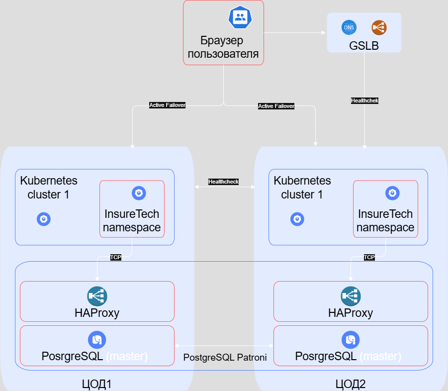

# Задание 1. Проектирование технологической архитектуры

## Анализ системы

### Система
- `core-app` - монолитное бэкенд-приложение
- `client-info` — сервис управления клиентскими данными
- `ins-product-aggregator` — сервис интеграции со страховыми компаниями
- `ins-comp-settlement` — сервис взаиморасчётов со страховыми компаниями
- Веб-приложение для клиентов сервиса (JS, React)
- Интеграция бэкенд-сервисов - **REST**
- Интеграция с внешними сервисами (5 страховых компаний) - **REST/SOAP/GraphQL**
- База данных включает 2 схемы
  - `core-db`
  - `ins-comp-settlement-db`

### Проблемы компании
- Медленная загрузка страниц сайта
  -  пиковая нагрузка на запросы поиска составила 50 RPS
  -  пиковая нагрузка на запросы оформления — 10 RPS
- Нарушается SLA для B2B-клиентов
  -  один из партнёров съедал все ресурсы приложения (250 RPS), выходя за рамки договоренностей (20 RPS)
- Приложение падает
  - медленная реакция команды (нет мониторинга)
  - простои сервиса несут убытки ~500 тр/час
  - репутационные потери для бизнеса

### Требования к системе:
- бесперебойная работа сервиса 24/7
- обслуживание клиентов из всех часовых поясов РФ
- требования к отказоустойчивости системы: RTO — 45 мин., RPO — 15 мин. доступность - 99,9%
- одинаковое время загрузки страниц для пользователей из разных регионов

### Схема

### Стратегия масштабирования и отказоустойчивости
- низкий RPS лечим стратегией горизонтального масштабирования + Cluster Autoscaler. 
- кластеры располагаем в разных географических зонах
- для повышения отказоустойчивости используем стратегию Active-Active с GSL-балансировщиком
- для резевирования БД используем Postgre SQL Patroni

### Конфигурация развертывания приложения в Kubernetes
- используем независимые кластеры в каждой площадке.
- балансировка между кластерами будет обеспечиваться Global Server Load Balancer
- фейловер стратегия будет active-active из-за крайне высоких требований к доступности сервиса.
- БД на Postgres => применим готовый шаблон конфигурации "Patroni"
